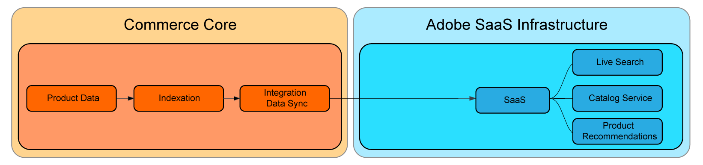
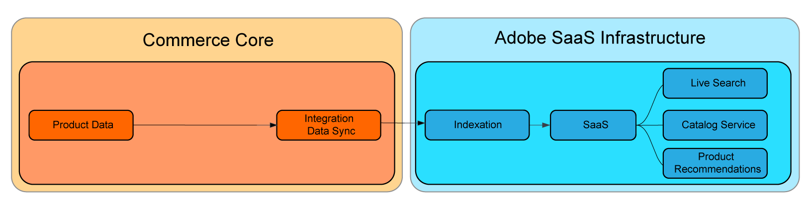

# SaaS Price Indexing

SaaS price indexing speeds up the time that it takes for price changes to get reflected on [Commerce Services ](../landing/saas.md) after they have been submitted. This allows merchants with large, complex catalogs, or with multiple websites or customer groups, to continually process price changes.
If you have a headless storefront or use the [catalog-adapter](./catalog-adapter.md) extension, customers can disable the Adobe Commerce core price indexer.

Computational heavy processes such as indexation and price calculation have been moved from the Commerce core to Adobe's Cloud infrastructure. This allows merchants to quickly scale up resources to boost price indexation times, and reflect those changes faster.

The Core indexing data flow to SaaS services looks like:



With SaaS price indexing, the flow is:



All merchants using Commerce Services can benefit from these improvements, but those who will see the greatest gains are customers with: 

* Constant price changes: Merchants that require repeated changes to their prices to meet strategic goals such as frequent promotions, seasonal discounts, or inventory markdowns.
* Multiple websites and/or customer groups: Merchants with shared product catalogs across multiple websites (domains/brands) and/or customer groups. 
* Large number of unique prices across websites or customer groups: merchants with extensive shared product catalogs that contain unique prices across websites or customer groups, such as B2B merchants with pre-negotiated prices, brands with different pricing strategies.

SaaS price indexing is available for free for customers using Adobe Commerce services and supports price calculation for all built-in Adobe Commerce product types.

This mini-guide describes how SaaS price indexing works and how to enable it.

## Requirements

* Adobe Commerce 2.4.4+
* At least one of the following Commerce Services with the latest version of Adobe Commerce extension:

    * [Catalog Service](../catalog-service/overview.md) 
    * [Live Search](../live-search/guide-overview.md)
    * [Product Recommendations](../product-recommendations/guide-overview.md)

Luma and Adobe Commerce Core GraphQL users can install the [`catalog-adapter`](catalog-adapter.md) extension that provides Luma and Core GraphQl compatibility and disables the Adobe Commerce Product Price indexer.

The Saas Price Indexer only works with prices displayed through Commerce Services: Live Search, Catalog Service and Product Recommendations.

## Usage

After upgrading your Adobe Commerce instance with SaaS price indexing support, sync the new feeds: 

```
bin/magento saas:resync --feed=scopesCustomerGroup
bin/magento saas:resync --feed=scopesWebsite
bin/magento saas:resync --feed=prices
```

## Prices for custom product types

Price calculations are supported for custom product types such as base price, special price, group price, catalog rule price, etc.

If you have a custom product type that uses a specific formula to calculate final price, you can extend the behaviour of the product price feed.

## Usage

   ```xml
   <config xmlns:xsi="http://www.w3.org/2001/XMLSchema-instance"
           xsi:noNamespaceSchemaLocation="urn:magento:framework:ObjectManager/etc/config.xsd">
       <type name="Magento\ProductPriceDataExporter\Model\Provider\ProductPrice">
           <plugin name="custom_type_price_feed" type="YourModule\CustomProductType\Plugin\UpdatePriceFromFeed" />
       </type>
   </config>
   ```

New feeds should be manually synced with the `resync` [CLI command](https://experienceleague.adobe.com/docs/commerce-merchant-services/user-guides/data-services/catalog-sync.html#resynccmdline). Otherwise, the data gets refreshed in the standard sync process. Get more information about the [Catalog Sync](../landing/catalog-sync.md) process.

## Usage scenarios

### Luma with no extension dependencies

* A Luma or Adobe Commerce Core GraphQL merchant who has a required service installed (Live Search, Product Recommendations, Catalog Service)
* No third-party extensions relying on the PHP core price indexer
* Selling simple, configurable, grouped, virtual, and bundle dynamic products

1. Enable new feeds.
1. Install the catalog adapter.

### Luma and Adobe Commerce Core GraphQl with PHP core price indexer dependencies

* A Luma or Adobe Commerce Core GraphQL merchant who has a supported service installed (Live Search, Product Recommendations, Catalog Service)
* With a third-party extension relying on the PHP core price indexer
* Selling simple, configurable, grouped, virtual, and bundle dynamic products

1. Enable the new feeds
1. Install the catalog adapter.
1. Re-enable the PHP core price indexer. 
1. Use new feeds and the Luma compatibility code in the `catalog-adapter` module.

### Headless merchant

* A headless merchant who has a supported service installed (Live Search, Product Recommendations, Catalog Service)
* No reliance on PHP core price indexer
* Selling simple, configurable, grouped, virtual, and bundle dynamic products

1. Enable new feeds
1. Install the catalog adapter, which disables the PHP core price indexer.

## Custom prices

The SaaS price indexer supports custom product type price features that are available in the Adobe Commerce, such as special price, group price, and catalog rule price.

For example: there is a custom product type  `custom_type` and a product with the SKU "Custom Type Product".

By default, the Commerce Data Export extension sends the following price feed to the price indexer:

```json
{
    "sku": "Custom Type Product",
    "type": "SIMPLE", // must be "SIMPLE" regardless of the real product type
    "customerGroupCode": "0",
    "websiteCode": "base",
    "regular": 123, // the regular base price found in catalog_product_entity_decimal table
    "discounts":    // list of discounts: special_price, group, catalog_rule
    [
        {
            "code": "catalog_rule",
            "price": 102.09
        }
    ],
    "deleted": false,
    "updatedAt": "2023-07-31T13:07:54+00:00"
}
```

If "Custom Product Type" uses a unique formula to calculate product price, system integrators can override the price and discount fields by extending the Commerce Data Export extension. 

1. Create a plugin on the `Magento\ProductPriceDataExporter\Model\Provider\ProductPrice` class.

`di.xml` file:

```xml
<config xmlns:xsi="http://www.w3.org/2001/XMLSchema-instance"
        xsi:noNamespaceSchemaLocation="urn:magento:framework:ObjectManager/etc/config.xsd">
    <type name="Magento\ProductPriceDataExporter\Model\Provider\ProductPrice">
        <plugin name="custom_type_price_feed" type="YourModule\CustomProductType\Plugin\UpdatePriceFromFeed" disabled="false" />
    </type>
</config>
```

1. Create a method with the custom formula:

```php
class UpdatePriceFromFeed
{
    /**
    * @param ProductPrice $subject
    * @param array $result
    * @param array $values
    *
    * @return array
    */
    public function afterGet(ProductPrice $subject, array $result, array $values) : array
    {
        // Get all custom products, prices and discounts per website and customer groups
        // Override the output $result with your data for the corresponding products
        return $result;
    }
}
```
