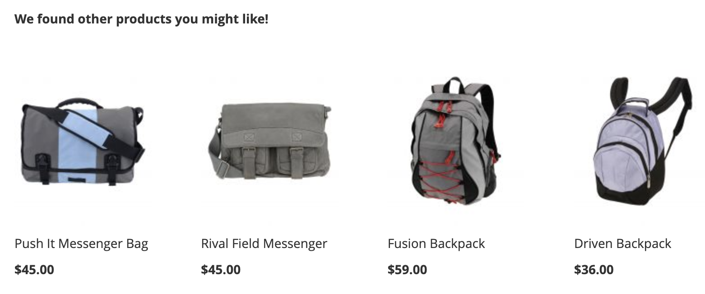
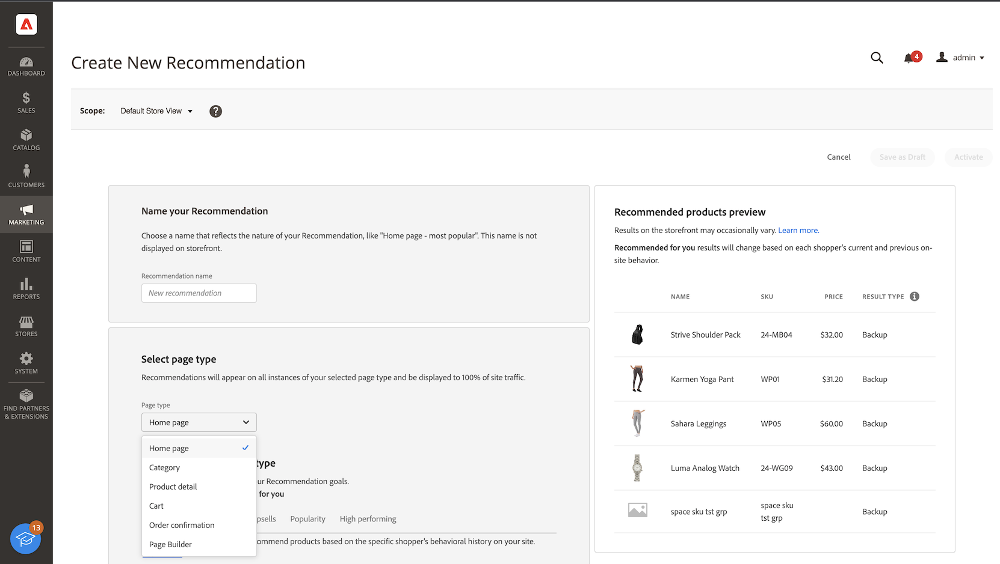
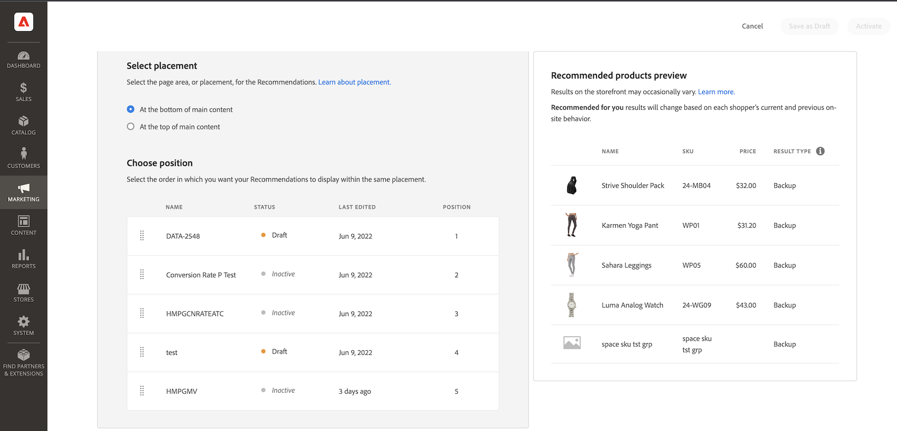
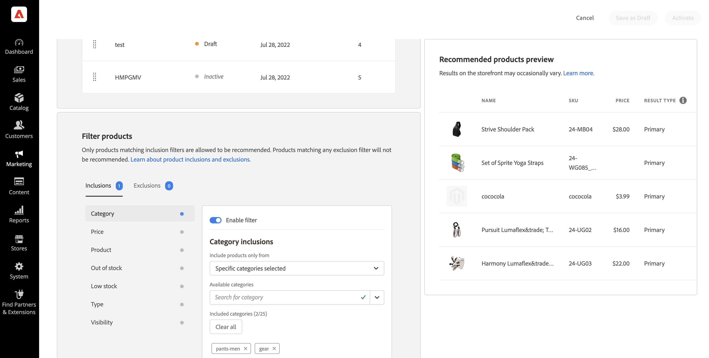
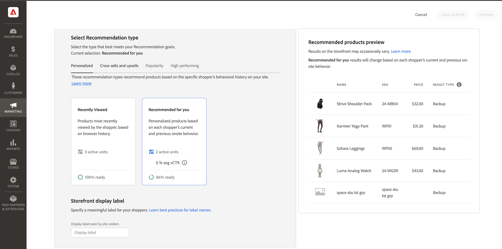

# Create New Recommendation

When you create a recommendation, you create a _recommendation unit_, or widget, that contains the recommended product _items_.

_Recommendation unit_

When you activate the recommendation unit, Adobe Commerce starts to [collect data](workspace.md) to measure impressions, views, clicks, and so on. The [!DNL Product Recommendations] table displays the metrics for each recommendation unit to help you make informed business decisions.

>[!NOTE]
>
>Product Recommendation metrics are optimized for Luma storefronts. If your storefront is non-Luma based, how the metrics track data depends on how you [implement the event collection](events.md).

1. On the _Admin_ sidebar, go to **Marketing** > _Promotions_ > **Product Recommendations** to display the _Product Recommendations_ workspace.

1. Specify the [Store View](https://experienceleague.adobe.com/en/docs/commerce-admin/start/setup/websites-stores-views) where you want the recommendations to display.

   >[!NOTE]
   >
   > Page Builder recommendation units must be created in the default store view, but then can be used anywhere. To learn more about creating product recommendations with Page Builder, see [Add Content - Product Recommendations](https://experienceleague.adobe.com/en/docs/commerce-admin/page-builder/add-content/recommendations).

1. Click **Create Recommendation**.

1. In the _Name your Recommendation_ section, enter a descriptive name for internal reference, such as `Home page most popular`.

1. In the _Select page type_ section, select the page where you want the recommendation to appear from the following options:

   >[!NOTE]
   >
   > Product Recommendations are not supported on the Cart page when your store is configured to [display the shopping cart page immediately after adding a product to the cart](https://experienceleague.adobe.com/en/docs/commerce-admin/stores-sales/point-of-purchase/cart/cart-configuration).

   * Home Page
   * Category
   * Product Detail
   * Cart
   * Confirmation
   * [Page Builder](https://experienceleague.adobe.com/en/docs/commerce-admin/page-builder/add-content/recommendations)

   You can create up to five active recommendation units for each page type, and up to 25 for Page Builder. The page type is grayed out When the limit is reached.

   
   _Recommendation name and page placement_

1. In the _Select Recommendation type_ section, specify the [type of recommendation](type.md) you want to appear on the selected page. For some pages, the [placement](placement.md) of recommendations is limited to certain types.

1. In the _Storefront display label_ section, enter the [label](placement.md#recommendation-labels) that is visible to your shoppers, such as "Top sellers".

1. In the _Choose number of products_ section, use the slider to specify how many products you want to appear in the recommendation unit.

   The default is `5`, with a maximum of `20`.

1. In the _Select placement_ section, specify the location where the recommendation unit is to appear on the page.

   * At the bottom of main content
   * At the top of main content

1. (Optional) To change the order of the recommendations, select, and move the rows in the _Choose position_ table.

   The _Choose position_ section displays all recommendations (if any) created for the page type you selected.

   
   _Recommendation order on page_

1. (Optional) In the _Filters_ section, [apply filters](filters.md) to control which products appear in the recommendation unit.

   
   _Recommendation product filters_

1. When complete, click one of the following:

   * **Save as draft** to edit the recommendation unit later. You cannot modify the page type or recommendation type for a recommendation unit in a draft state.

   * **Activate** to enable the recommendation unit on your storefront.

## Readiness indicators

Readiness indicators show which recommendation types will perform best based on the catalog and behavioral data available. You can also use readiness indicators to determine if you have issues with your [eventing](events.md) or if you do not have enough traffic to populate the recommendation type.

Readiness indicators are categorized into either [static-based](#static-based) or [dynamic-based](#dynamic-based). Static-based use catalog data only; whereas dynamic-based use behavioral data from your shoppers. That behavioral data is used to [train machine learning models](events.md) to build personalized recommendations and to calculate their readiness score.

### How readiness indicators are calculated

The readiness indicators are an indication of how much the model is trained. Indicators are dependent upon the types of events collected, the breadth of products interacted with, and the size of the catalog.

The readiness indicator percentage is derived from a calculation that indicates how many products might be recommended depending on the recommendation type. Statistics are applied to products based on the overall size of the catalog, the volume of interactions (such as views, clicks, add-to-carts), and the percentage of SKUs that register those events within a certain time window. For example, during peak holiday season traffic, the readiness indicators might show higher values than in times of normal volume.

As a result of these variables, the readiness indicator percent can fluctuate. This explains why you might see that recommendation types come in and out of being "Ready to deploy".

Readiness indicators are calculated based on a couple factors:

* Sufficient result set size: Are there enough results being returned in most scenarios to avoid using [backup recommendations](events.md#backuprecs)? 

* Sufficient result set variety: Do the products being returned represent a variety of products from your catalog? The goal with this factor is to avoid having a minority of products being the only items recommended across the site. 

Based on the above factors, a readiness value is calculated and displayed as follows:

* 75% or higher means that the recommendations suggested for that recommendation type will be highly relevant.
* At least 50% means that the recommendations suggested for that recommendation type will be less relevant.
* Less than 50% means that the recommendations suggested for that recommendation type may not be relevant. In this case, [backup recommendations](events.md#backuprecs) are used.

Learn more about [why readiness indicators might be low](#what-to-do-if-the-readiness-indicator-percent-is-low).

### Static-based

The following recommendation types are static-based because they only require catalog data. No behavioral data is used.

* _More Like This_
* _Visual Similarity_

### Dynamic-based

The following recommendation types are dynamic-based because they use storefront behavioral data.

Last six months of storefront behavioral data:

* _Viewed this, viewed that_
* _Viewed this, bought that_
* _Bought this, bought that_
* _Recommended for you_

Last seven days of storefront behavioral data:

* _Most Viewed_
* _Most Purchased_
* _Most Added to Cart_
* _Trending_
* _View to Purchase Conversion_
* _View to Cart Conversion_

Most recent shopper behavioral data (only views):

* _Recently Viewed_

### Visualize progress

To help you visualize the training progress of each recommendation type, the _Select Recommendation type_ section displays a measure of readiness for each type.

_Recommendation type_

>[!NOTE]
>
>Indicators may never reach 100%.

The readiness indicator percent for recommendation types that depend on catalog data do not change much since the merchant's catalog does not change often. But the readiness indicator percent for recommendation types based on shopper behaviorial data can change often depending on daily shopper activity.

#### What to do if the readiness indicator percent is low

A low readiness percentage indicates that there are not many products from your catalog that are eligible to be included in recommendations for this recommendation type. This means that there is a high probability that [backup recommendations](events.md#backuprecs) are returned if you deploy this recommendation type anyway.

>[!IMPORTANT]
>
>_Bundle_, _Grouped_, and custom product types are not supported. If a large portion of your catalog has these product types, you can expect a low readiness score. Additionally, any SKUs with spaces can reduce recommendation relevancy and should be avoided.

The following lists possible reasons and solutions to common low readiness scores:

* **Static-based** - Low percentages for these indicators can be caused by missing catalog data for the displayable products. If they are lower than expected, a full sync can fix this issue.
* **Dynamic-based** - Low percentages for dynamic-based indicators can be caused by:

   * Missing fields in the required [storefront events](events.md) for the respective recommendation types (requestId, product context, and so on.)
   * Low traffic on the store so the volume of behavioral events we receive is low.
   * The variety of storefront behavioral events across different products in your store is low. For example, if only ten percent of your products are viewed or bought most of the time then the respective readiness indicators will be low.

## Preview Recommendations {#preview}

The _Recommended products preview_ panel is always available with a sample selection of products that might appear in the recommendation unit when it is deployed to the storefront.

To test a recommendation when working in a non-production environment, you can fetch recommendation data from a [different source](settings.md). This allows merchants to experiment with rules and preview the recommendations before deploying to production.

|Field|Description|
|---|---|
|Name|The name of the product.|
|SKU|The Stock Keeping Unit assigned to the product|
|Price|The price of the product.|
|Result Type|Primary - indicates that there is enough training data collected to display a recommendation. Backup - indicates that there is not enough training data collected so a backup recommendation is used to fill the slot. Go to [Behavioral Data](events.md) to learn more about machine learning models and backup recommendations.|

As you create your recommendation unit, experiment with the page type, recommendation type, and filters to get immediate real-time feedback about the products that will be included. As you begin to understand which products appear, you can configure the recommendation unit to meet your business needs.

Adobe Commerce [filters](filters.md) recommendations to avoid displaying duplicate products when multiple recommendation units are deployed on a single page. As a result, the products that appear in the preview panel might differ from those that appear in the storefront.

>[!NOTE]
>
> You cannot preview the `Recently viewed` recommendation type because the data is not available in the Admin.
