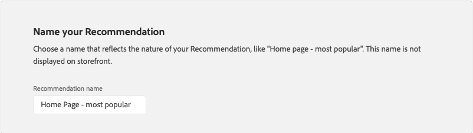
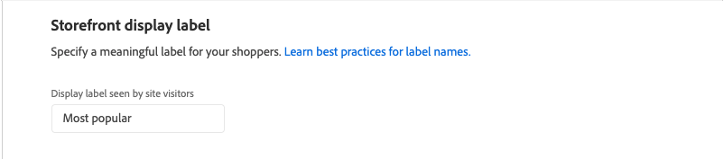
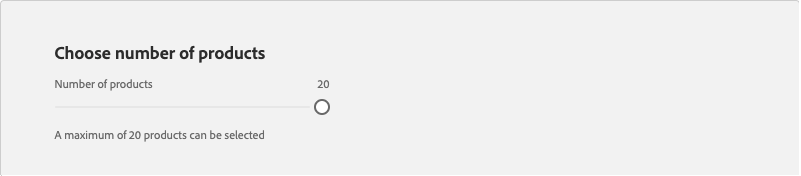
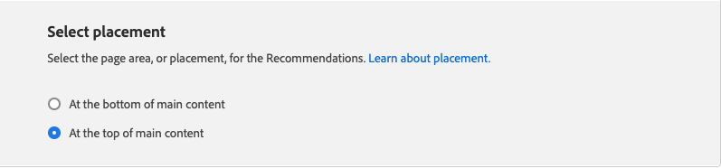
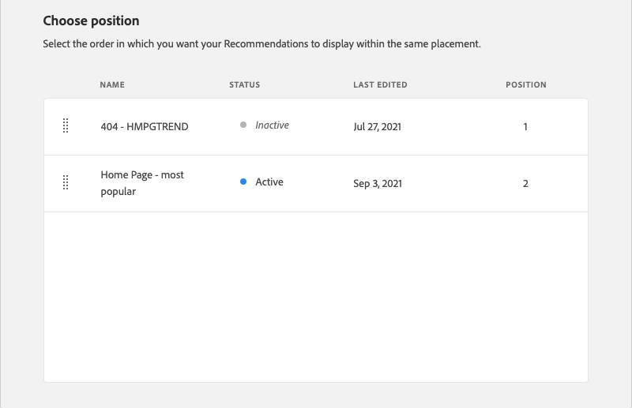
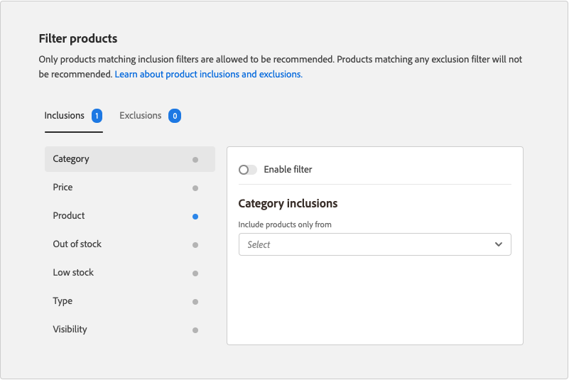
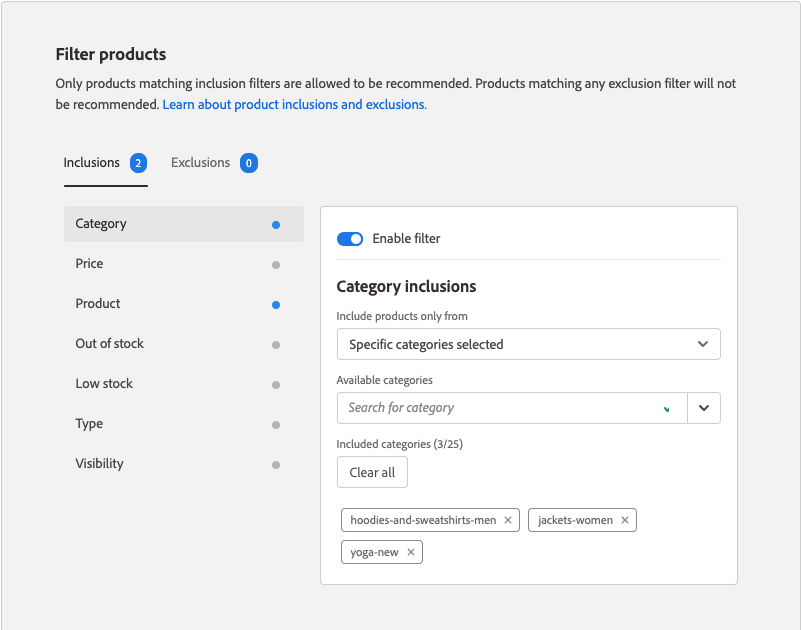

# Edit Recommendation

The Edit Recommendation page gives you the ability to adjust the individual settings that make up the recommendation. All settings can be edited except the page type and recommendation type. The following settings can be edited:

- [Recommendation name](#name)
- [Storefront label](#label)
- [Number of products](#number)
- [Placement and Position](#placement)
- [Filter products](#filters)

The preview on the right side of the page shows how the recommendation with the current settings might appear in the storefront. The _Recommended products preview_ remains visible for reference as you scroll down the page. The preview displays a thumbnail product image, the product name, SKU, price, and result type for each product returned. The result type indicates if there is enough primary behavioral data to generate the recommendation, or if it is using backup behavioral data.

## Edit a recommendation

1. On the _Admin_ sidebar, go to **Marketing** > _Promotions_ > **Product Recommendations**.

1. Select the recommendation that you want to edit.

1. Click **Edit**. Then, follow the instructions below to make the changes you need.

1. When complete, click **Save Changes**.

### Recommendation name {#name}

Choose a descriptive name that indicates the purpose of the recommendation. The name is for internal reference and does not appear in the storefront.

### Storefront label {#label}

Enter the text that you want to use as a label for the recommendation unit in the storefront.

### Number of products {#number}

Adjust the slider to display up to 20 products in the recommendation unit.

### Placement and position {#placement}

1. Choose the page location where the recommendation unit is to appear in the storefront.

   - At the bottom of main content
   - At the top of main content

   

1. To change the order of the recommendations that are included in the unit, use the **Move**  control to drag the recommendations into position.

   

### Filter products {#filters}

Any changes made to product [filters](filters.md) are reflected in the _Recommended products preview_. Only products that match inclusion filters are allowed to be recommended. Products that match any exclusion filters are not recommended.

The _Inclusions_ and _Exclusions_ tabs list the available filters of each type. In the list, each active filter is marked with a blue dot.

- To display the details about each filter, click the filter name.
- To change the filter status, set the **Enable filter** toggle to the `on` or `off` position.

The filter settings describe the products to be included or excluded in the recommendation unit. For example, the _Category_ filter inclusion settings tell the system to include products only from the selected categories.

