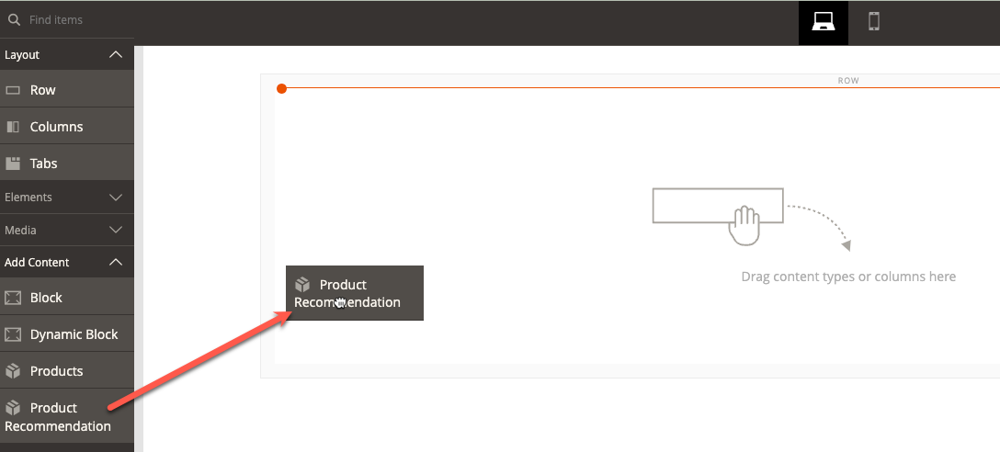
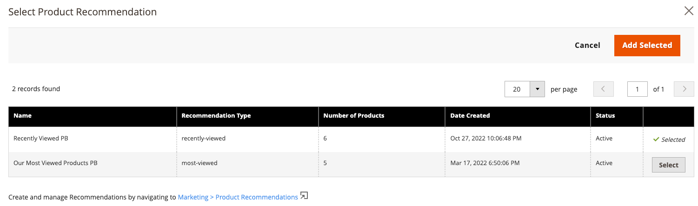

# [!DNL Page Builder] Integration

Product Recommendations can be integrated within any Page Builder content that you deploy on your site.

>[!NOTE]
>
> You can have up to 25 recommendation units on a native Page Builder page. Non-native Page Builder pages can have up to 5 recommendation units. See [Create New Recommendation](create.md) for more information.

## Using Product Recommendations with Page Builder content

1. Create a Recommendation unit in the default store view of a website. They must be created in the default store view even if you plan to use them in different store views.
1. In Page Builder, select the Product Recommendations content widget and place on your site. 

1. Click **Edit Product Recommendation**
1. Click **Select**
1. Select your previously created Recommendation unit and click **Add Selected**

1. Make any other edits to the Page Builder content and save your changes. 

At render time, the context and scope of the Page Builder content is respected by the Recommendation unit.
