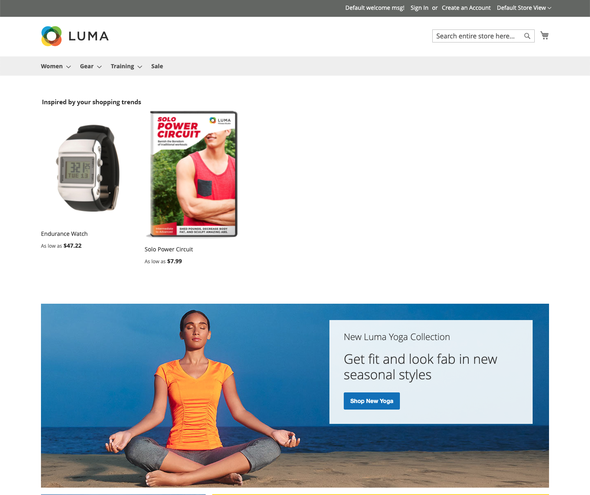
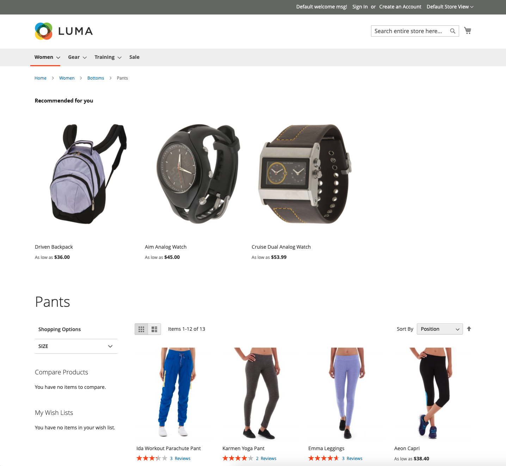

# Placement and Labels

With so many recommendation types to choose from, which should you use on each page? If you are not sure where to begin, try the following:

|Home page|`Recommended for you`|
|Product page|`Viewed this, viewed that`|
|Cart|`Bought this, bought that`|

You can track the [metrics](workspace.md) and adjust if needed. Remember that experimentation is key.

Some storefront pages restrict where you can place the recommendations. You can place the recommendations in one of the following page locations. Refer to the table below for more information.

- At the top of main content - Recommendations appear above the main content area just below the top navigation bar.
- At the bottom of main content (default) - Recommendations appear below the main content area and before any other content blocks on the page, such as _Related Products_.

_Recommendation at top of home page_

## Recommendation labels

The label that is assigned to a recommendation in the storefront affects how shoppers interpret its relevancy to them. The following labels are frequently used for each type of recommendation.

_Recommendation at top of search results_

|Recommendation Type|Recommended Labels|
|---|---|
|Most viewed  Most added to cart Most purchased Conversion (view to cart) Conversion (view to purchase)|Most popular Popular items Trending Popular right now Recently popular Popular items inspired by this item (PDP) Top sellers You might be interested in|
|Recommended for you|Just for you Recommended for you Inspired by your shopping trends|
|Viewed This, Viewed That|Customers who viewed this item also viewed Customers also viewed Related items|
|Viewed This, Bought That|Customers who viewed this ultimately bought Customers ultimately purchased What do others buy after viewing this item?|
|Bought This, Bought That|Get everything you need Don't forget these Frequently bought together|
|More Like This|More items like this Similar to this|
|Generic|You may also like Shoppers also liked Similar options Related items|
|Trending|Trending Trending now Recently trending Hot items Trending related products (PDP)|
|Recently viewed|Recently viewed Take another look|

## Supported recommendations by page

The following table lists the storefront pages where you can place recommendations and the recommendation types allowed on each page.

|Page|Placement Recommendations|
|---|---|
|Home page|At the top of main content At the bottom of main content (default)|Most viewed Most purchased Most added to cart Recommended for you Trending|
|Category|At the top of main content At the bottom of main content (default)|Most viewed Most purchased Most added to cart Recommended for you Trending|
|Product Detail|At the bottom of main content (default)|Most viewed Most purchased Most added to cart Viewed this, viewed that Viewed this, bought that Bought this, bought that More like this Trending Visual similarity|
|Cart|At the bottom of main content (default)|Most viewed Most purchased Most added to cart Viewed this, viewed that Viewed this, bought that Bought this, bought that More like this Trending|
|Confirmation|At the bottom of main content (default)|Most viewed Most purchased Most added to cart Viewed this, viewed that Viewed this, bought that Bought this, bought that More like this Trending|
|Page Builder|[Drag and drop](https://docs.magento.com/user-guide/cms/page-builder-add-recommendations.html#add-an-existing-recommendation-unit) to position content type|Most viewed Most purchased Most added to cart Recommended for you Trending|
