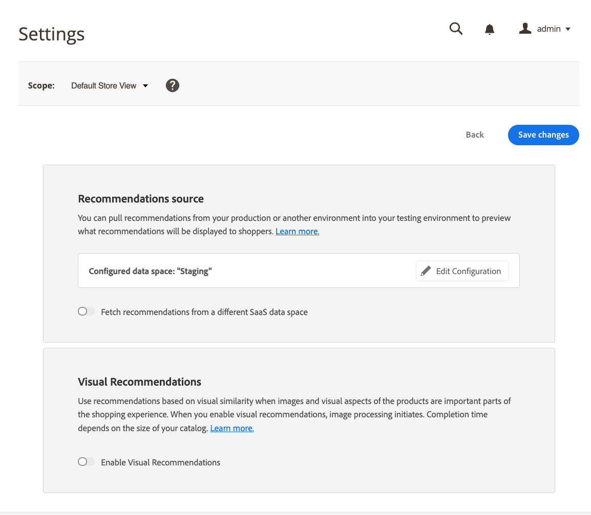

# Settings

When you [configure a SaaS data space](https://docs.magento.com/user-guide/configuration/services/saas.html) for Recommendations, the SaaS data space collects catalog data and storefront-behavioral data. [Adobe Sensei](https://www.adobe.com/sensei.html) analyzes that data and computes product associations used to serve Product Recommendations.

Non-production environments for testing or staging usually don't have the quantity or quality of storefront behavioral data to serve realistic product recommendations. Actual shopper behavior at scale can be captured only in a production environment. To solve this problem, Adobe Commerce allows you to use product recommendations from your production environment with other, non-production SaaS data spaces. Using actual storefront data in a non-production environment allows you to preview the recommendations your shoppers see and experiment with different recommendation types and placement locations. Recommendations from a different SaaS data space can be previewed by shoppers, but not clicked.

## Choose the recommendations source

To change the source of your product recommendations data, choose the SaaS data space with the behavioral data that you want to use. Before you begin, make sure that:

- Storefront data collection must be [configured and enabled](install-configure.md) for your production environment and [verified](verify.md) that behavioral data is being sent to Adobe Commerce.
- Your non-production environment catalog should be essentially the same as your production catalog. Using similar catalogs ensures that the product recommendation units returned closely mimic those in production.

1. Log in to the Admin of your non-production Adobe Commerce environment.

1. On the _Admin_ sidebar, go to **Marketing** > _Promotions_ > **Product Recommendations**.

1. Click **Settings**.

   
   _Settings_

1. In the _Recommendations source_ section, enable the **Fetch recommendations from a different SaaS data space** option. The _Recommendations source_ section only appears in a non-production environment.

   A list of _Available SaaS Data Spaces_ appears.

   
   _Settings_

1. Select the SaaS data space that has shopper data you want to use.

1. Click **Save changes**.

   Adobe Commerce now fetches recommendations from the selected data space.

   >[!NOTE]
   >
   > While you can view recommendations fetched from another SaaS data space on the non-production storefront, you cannot click the recommendations.

### Configure a new SaaS data space

1. In the Recommendations source section, click **Edit Configuration**.

1. Follow the instructions to configure a new [[!DNL Commerce] service](/help/landing/saas.md).

## Enable visual recommendations

If the [Visual Product Recommendations](install-configure.md) module is installed, you must enable Visual Recommendations to use the [Visual Similarity](type.md#visualsim) recommendation type.

In the _Visual Recommendations_ section, set **Enable Visual Recommendations** to the active position.
