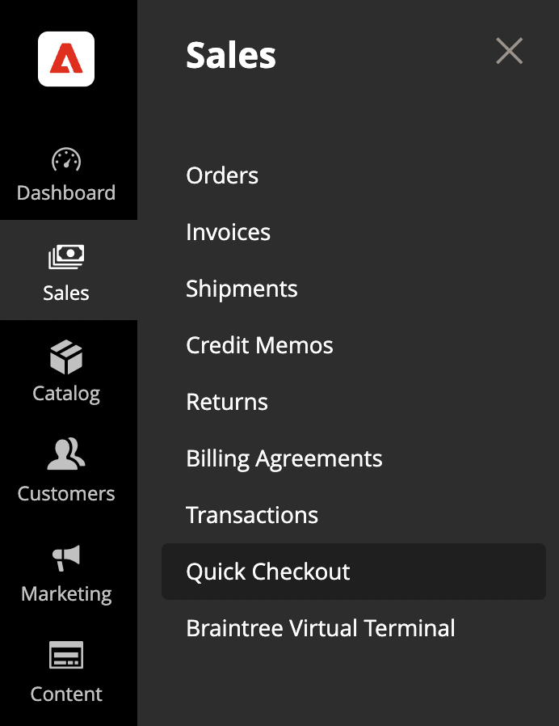
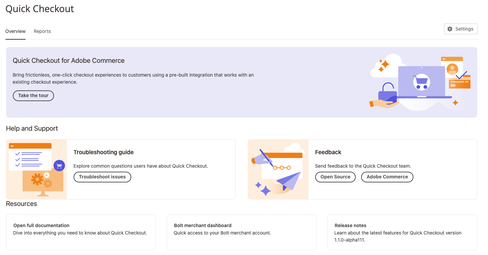

# Introduction to the [!DNL Quick Checkout] Admin panel

[!DNL Quick Checkout] for Adobe Commerce and Magento Open Source provides an Admin panel view with all the necessary information to set up and use the extension.

1. On the _Admin_ sidebar, go to **[!UICONTROL Sales]** > **[!UICONTROL Quick Checkout]**:

   

1. In this view, you can access the _Admin panel_ overview, _Resources_ about [!DNL Quick Checkout], get _Help and Support_, or configure the extension via _Settings_.

   

Check that user has the proper roles and permissions granted in order for the [!DNL Quick Checkout] Admin panel to show. See the [User roles and permissions](../quick-checkout/user-roles-setup.md) topic for more information.

Refer to the [Onboarding](../quick-checkout/onboarding.md) topic for more information on how to configure the [!DNL Quick Checkout] for Adobe Commerce.

## Home

| Field | Description |
|---|---|
| [!UICONTROL Overview] | The Overview tab shows all the resources for using [!DNL Quick Checkout]. |
| [!UICONTROL Reports] | The Reports tab shows comprehensive [!DNL Quick Checkout] information. |

## Help and Support

| Field | Description |
|---|---|
| [!UICONTROL Troubleshooting guide] | The Adobe Commerce Help Center contains [!DNL Quick Checkout] troubleshooting articles. |
| [!UICONTROL Feedback] | Provide feedback to the team. |

## Resources

| Field | Description |
|---|---|
| [!UICONTROL Open documentation] | See the latest docs for [!DNL Quick Checkout]. |
| [!UICONTROL [!DNL Bolt] merchant dashboard] | Access your [!DNL Bolt] merchant account and dashboard. |
| [!UICONTROL Release notes] | Learn about the latest changes for [!DNL Quick Checkout]. |

## Settings

In the Admin panel view, click **[!UICONTROL Settings]** to access the [!DNL Quick Checkout] configuration. See [Admin configuration](onboarding.md#complete-admin-configuration) for more information.