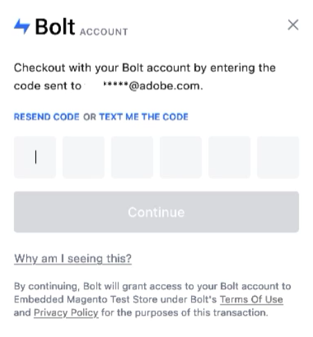

# [!DNL Quick Checkout] flow

This section provides an overview of the typical checkout experience using the [!DNL Quick Checkout] for Adobe Commerce extension.

A successful [!DNL Quick Checkout] flow consists of the following steps:

1. Open your storefront and add items in your cart.
1. Proceed to checkout.

  

1. When prompted, enter an email address associated with a [!DNL Bolt] account.
1. Input the One-Time Password (OTP) sent to that [!DNL Bolt] account's email address or phone number.

  

1. Once logged in with your [!DNL Bolt] account, checkout details are automatically filled in:

   - Shipping information
   - Payment method
   
   >[!NOTE]
   >
   > You can use your existing wallet information (address or credit card information) even if your checkout details are automatically filled in.

1. Place Order.

The [!DNL Quick Checkout] is compatible with standard additional Adobe Commerce checkout options, such as [gift cards](https://docs.magento.com/user-guide/catalog/product-gift-card.html) or [discount codes](https://docs.magento.com/user-guide/marketing/price-rules-cart-coupon.html).

## [!DNL Quick Checkout] use cases

The [!DNL Quick Checkout] allows for multiple use cases during a checkout flow:

- [Guest user](../quick-checkout/checkout-bolt.md) with a registered or new [!DNL Bolt] account.
- An existing [Adobe Commerce user](../quick-checkout/checkout-adobe-commerce.md) with or without a registered [!DNL Bolt] account.

## Get help

Contact Adobe Commerce Support through the [Adobe Commerce Help Center](https://experienceleague.adobe.com/docs/commerce-knowledge-base/kb/overview.html) for any assistance.
