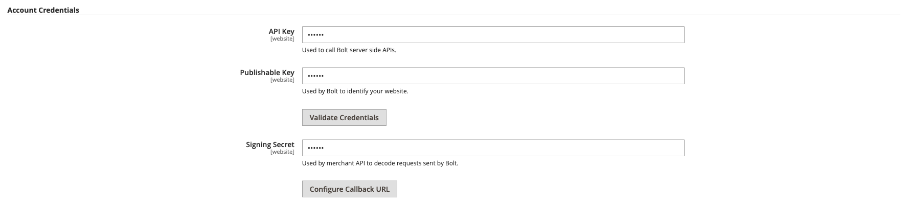
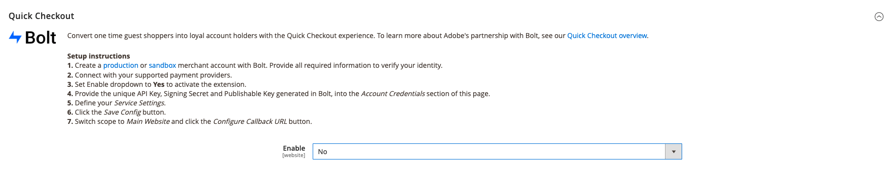
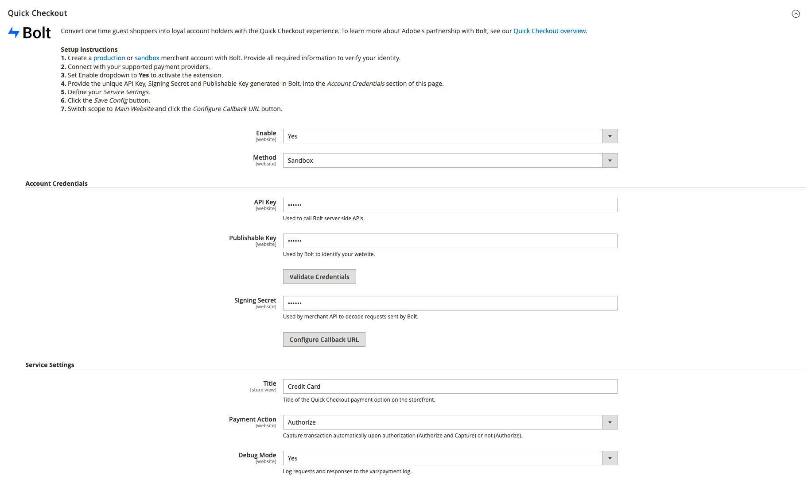

# [!DNL Quick Checkout] onboarding

To get started using the [!DNL Quick Checkout] for Adobe Commerce extension you must complete a few onboarding steps to connect your instance with our checkout functionality.

1. [Get extension](#get-extension).
1. [Create a production or sandbox merchant account with [!DNL Bolt]](#create-account-with-bolt). Provide all required information to verify your identity.
1. [Provide the unique [!DNL API Key] and [!DNL Publishable Key]](#obtain-api-credentials) generated in [!DNL Bolt].
1. [Set up a payment provider in the [!DNL Bolt] account](#configure-payment-providers).
1. [Set Enable dropdown to Yes](#enable-extension) to activate the extension.
1. [Define your Service Settings](#complete-admin-configuration) to configure the [!DNL Quick Checkout] extension.
1. [Click the Save Config](#enable-live-quick-checkout) button to enable extension.
1. Switch scope to **Main Website** and [click the Configure Callback URL](#check-shopper-valid-account) button.

>[!NOTE]
>
> If you do not configure your [!DNL Bolt] accounts you cannot set up your sandbox or production environments.

## Prerequisites

In order to use the [!DNL Quick Checkout], you must have the following available for [!DNL Bolt]:

- Supported payment providers
- Merchant and Production account in [!DNL Bolt]
- API and [!DNL Publishable key] generated in [!DNL Bolt]

Refer to the [prerequisites](../quick-checkout/prerequisites.md) topic for more information.

See [API credentials](#obtain-api-credentials) to learn how to create or access your [!DNL API keys] for your instance.

## Get extension

See the [install](../quick-checkout/install.md) topic for detailed information about obtaining the extension.

## Create account with [!DNL Bolt]

Before configuring the [!DNL Quick Checkout] in your Adobe Commerce Admin it is required to create a [sandbox](https://merchant-sandbox.bolt.com/register?platform=magento2){target="_blank"} and [production](https://merchant.bolt.com/register?platform=magento2){target="_blank"}  merchant accounts in [!DNL Bolt]. Provide all of the required details to create an account in [!DNL Bolt].

Refer to the [test and validate](../quick-checkout/testing.md) topic for more information.

## Obtain API credentials

To use the [!DNL Quick Checkout] you require [!DNL Bolt] unique keys and [!DNL signing secret]. Obtain the following [!DNL API keys] by navigating to **Developers** > **API** > **Keys** in the **Bolt Merchant Dashboard**.

- [!DNL API key]: A private key used by your back end to interact with [!DNL Bolt] APIs.
- [!DNL Publishable key]: A key used by your front end to interact with [!DNL Bolt] APIs.
- [!DNL Signing secret]: Used for signature verification on requests received from [!DNL Bolt].

  

See the [[!DNL Bolt] environment details](https://help.bolt.com/developers/references/environment-details/#about-keys){target="_blank"} page to learn about keys and signing secret from [!DNL Bolt] for the [!DNL Quick Checkout] extension.

>[!CAUTION]
>
> You must create [!DNL API keys] for both sandbox and production environments.

## Configure payment providers

To connect your payment services provider follow the steps described in the [processor setup](https://help.bolt.com/integrations/adobe-quick-checkout/set-up/){target="_blank"} developer [!DNL Bolt] page.

## Enable extension

1. On the _Admin_ sidebar, go to **Stores** > _Settings_ > **Configuration**.
1. In the left panel, expand **Sales** and select **Checkout**.
1. In the [!DNL Quick Checkout] view, set **Enable** to `Yes`.

  

  >[!CAUTION]
  >
  > Quick checkout fields are only visible when **Enable** is set to `Yes`.

1. Select method (Sandbox or Production) to use.

   - Sandbox for testing and development purposes
   - Production to process transactions with the live payment processor

1. Validate credentials after providing your unique API and [!DNL Publishable keys].

>[!CAUTION]
>
> You must provide unique API and [!DNL Publishable] keys before enabling the extension otherwise customers will see a payment form and will not be able to place an order.

## Complete Admin configuration

1. On the _Admin_ sidebar, navigate to **Stores** > **Configuration** > **Checkout** to acess the general Checkout Admin config page.
1. In the _Service Settings_ section, provide all details required to enable the extension.
1. Set _Payment Action_ to either option:

   - `Authorize`: Do not capture transaction automatically upon authorization.
   - `Authorize and Capture`: Capture transaction automatically upon authorization.

For more information on the Adobe Commerce standard checkout options, refer to the [checkout](https://docs.magento.com/user-guide/configuration/sales/checkout.html) topic.

## Enable live Quick Checkout

To enable the [!DNL Quick Checkout] for Adobe Commerce extension:

1. Check that the [!UICONTROL Enable] dropdown is set to **Yes** to activate the extension.
1. Click **Save Config**.

## Check shopper valid account

To check if the shopper has a [!DNL Bolt] account:

1. Switch the scope to **Main Website**.
1. Click the **Configure Callback URL** button. This enables [!DNL Bolt] to determine if the shopper has an account. If they do, the OTP pop-up appears.

>[!CAUTION]
>
> Switching the scope to the **Main Website** ensures that the proper URL is set. Each website could have multiple domains.

See the [Site, Store, and View Scope](https://experienceleague.adobe.com/docs/commerce-admin/start/setup/websites-stores-views.html#scope-settings){target="_blank"} topic for more information about scopes in Adobe Commerce.

## Get help

The onboarding process is designed to guide you through the required steps for setting up and enabling the [!DNL Express Checkout] functionality.

Contact Adobe Commerce Support through the [Adobe Commerce Help Center](https://support.magento.com/hc/en-us/articles/360000913794-Adobe-Commerce-Help-Center-User-Guide) for any assistance.

See the [test and validate](../quick-checkout/testing.md) topic for more information.
