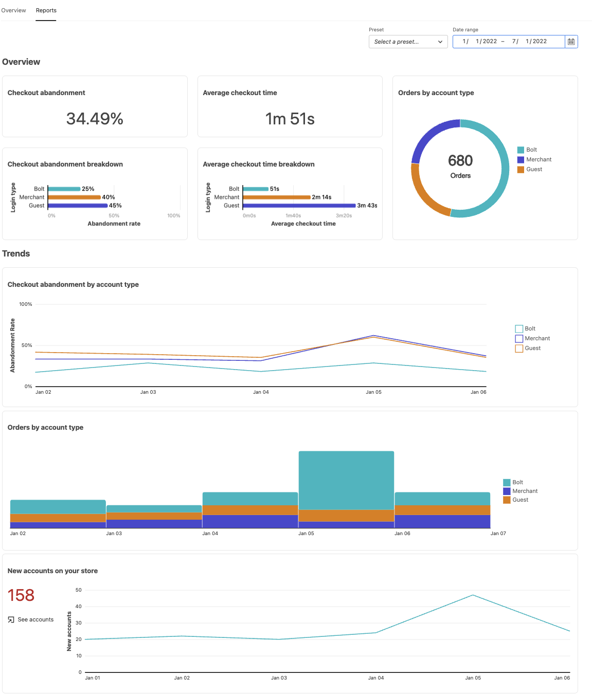
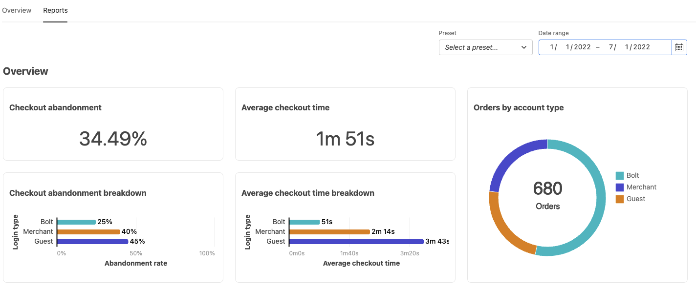
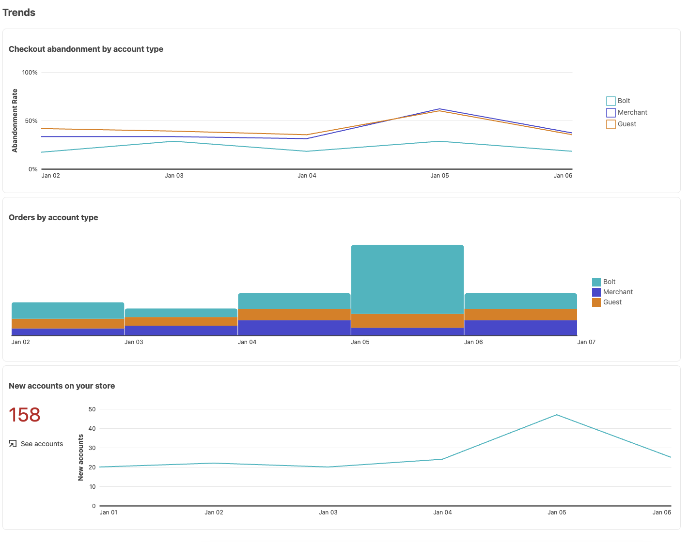
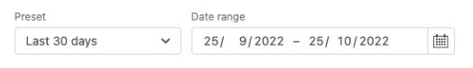

# Reports

[!DNL Quick Checkout] for Adobe Commerce and Magento Open Source offers you comprehensive reporting so that you can get detailed information of your store's checkout experience statistics.

>[!WARNING]
>
> To allow Adobe Commerce sharing checkout information with Bolt, the [**Checkout tracking**](../quick-checkout/settings-quick-checkout.md)  setting must enabled in the Admin. By default, this configuration option is set to **Yes**. If this option is set to **No**, reporting will be affected. Bolt refreshes the reporting information once per day at 03:00 AM  Eastern Standard Time (EST).

## Overview reports

The charts in the Overview section show detailed information about your store's checkout performance, including the average checkout time, new accounts created during checkout or checkout abandonment.

| Chart | Description |
|---|---|
| [!UICONTROL Checkout abandonment] | The percentage of visitors who exit the checkout process without completing a purchase. |
| [!UICONTROL Checkout abandonment breakdown] | The checkout abandonment divided by type of visitor. Tooltip shows a percentage difference between Bolt and Guest. Options: [!UICONTROL Bolt] / [!UICONTROL Merchant] / [!UICONTROL Guest] |
| [!UICONTROL Average checkout time] | The average time a visitor takes to complete the checkout process. |
| [!UICONTROL Average checkout time breakdown] | Average checkout time divided by type of visitor. Tooltip shows a percentage difference between Bolt and Guest. Options: [!UICONTROL Bolt] / [!UICONTROL Merchant] / [!UICONTROL Guest] |
| [!UICONTROL Orders by account type] | Orders placed divided by type of visitor. Options: [!UICONTROL Bolt] / [!UICONTROL Merchant] / [!UICONTROL Guest] |

## Trends reports

The charts in the Trends section show your checkout experience trends filterd by account type, or new accounts created during checkout.

| Chart | Description |
|---|---|
| [!UICONTROL Checkout abandonment by account type] | The checkout abandonment trend divided by type of visitor. Options: [!UICONTROL Bolt] / [!UICONTROL Merchant] / [!UICONTROL Guest] |
| [!UICONTROL Orders by account type] | Orders placed trend divided by type of visitor. Options: [!UICONTROL Bolt] / [!UICONTROL Merchant] / [!UICONTROL Guest] |
| [!UICONTROL New accounts on your store] | New accounts on your store trend. |

## Filter data

You can filter the results shown by date, or existing presets, like **Last 30 days**.

| Field | Description |
|---|---|
| [!UICONTROL Preset] | A dropdown that displays default presets that can be used to show specific ranges of data. By default: Last 30 days |
| [!UICONTROL Date range] | A dropdown that allows you to select a specific range of data depending on the selected dates. |
