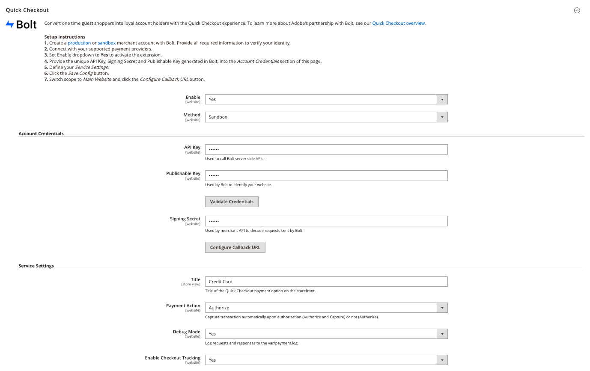

# [!DNL Quick Checkout] settings

[!DNL Quick Checkout] for Adobe Commerce and Magento Open Source provides a configuration view with all the necessary information to set up the extension.

To access these configuration settings:

1. On the _Admin_ sidebar, go to **Stores** > _Settings_ > **Configuration**.
1. In the left panel, expand **Sales** and select **Checkout**.

   

Refer to the [Onboarding](../quick-checkout/onboarding.md) topic for more information on how to configure the [!DNL Quick Checkout] for Adobe Commerce.

## Enable extension

| Field | Scope | Description |
|---|---|---|
| [!UICONTROL Enable] | website | Enable or disable [!DNL Quick Checkout] for your website. Options: [!UICONTROL Yes] / [!UICONTROL No] |
| [!UICONTROL Method] | website | Set the method, or environment, for your [!DNL Quick Checkout]. Options: [!UICONTROL Sandbox] / [!UICONTROL Production] |

## Account credentials

| Field | Scope | Description |
|---|---|---|
| [!UICONTROL API key] | website | A private key used by your back end to interact with [!DNL Bolt] APIs. |
| [!UICONTROL Publishable key] | website | A key used by your front end to interact with [!DNL Bolt] APIs. |
| [!UICONTROL Signing secret] | website | Used for signature verification on requests received from [!DNL Bolt]. |

## Service settings

| Field | Scope | Description |
|---|---|---|
| [!UICONTROL Title] | store view | Add the text for display as the title for this payment option in the Payment Method view during checkout. Options: [!UICONTROL text field] |
| [!UICONTROL Payment Action] | website | The [payment action](https://docs.magento.com/user-guide/configuration/sales/payment-methods.html#payment-actions){target="_blank"} for the specified payment method. Options: [!UICONTROL Authorize] / [!UICONTROL Authorize and Capture] |
| [!UICONTROL Debug Mode] | website | Enable or disable Debug Mode. Options: [!UICONTROL Yes] / [!UICONTROL No] |
| [!UICONTROL Enable checkout tracking] | website | Define if Adobe Commerce allows checkout tracking information to be shared with Bolt. Enabled by default. If disabled, reporting will be affected. Options: [!UICONTROL Yes] / [!UICONTROL No] |
