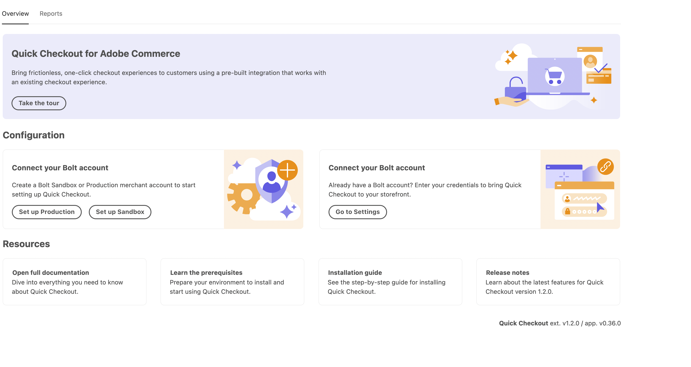
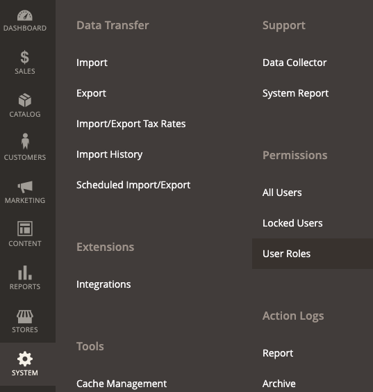
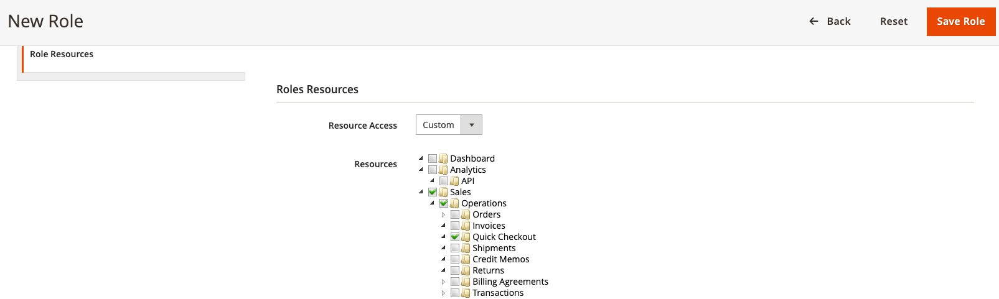

# [!DNL Quick Checkout] user setup

[!DNL Quick Checkout] provides an Admin panel with all the necessary information to start onboarding, using the extension, or include resources like access to docs, [!DNL Bolt] merchant dashboard or release notes.

To access the [!DNL Quick Checkout] Admin panel:

1. On the _Admin_ sidebar, navigate to **[!UICONTROL Sales]** > **[!UICONTROL Quick Checkout]**.

    

Refer to the [onboarding](../quick-checkout/onboarding.md) topic for more information on how to configure the [!DNL Quick Checkout] for Adobe Commerce.

To allow the user access and visibility to the [!DNL Quick Checkout] Admin panel, you need to check that the user has the proper role resources granted:

1. On the _Admin_ sidebar, go to **[!UICONTROL System]** > Permissions > **[!UICONTROL User Roles]**.

    

1. In the _Roles_ view, click **Add New Role** 
1. Select the [!DNL Quick Checkout] resources:

   

1. Click **Save Role**.

Refer to the [User Roles](https://docs.magento.com/user-guide/system/permissions-user-roles.html) page for more information on defining a role, or assigning a role to a user.
