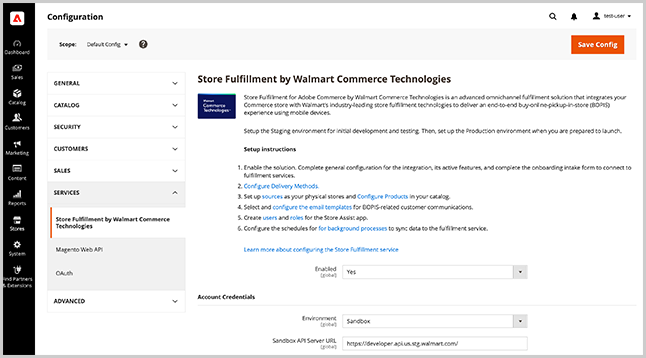
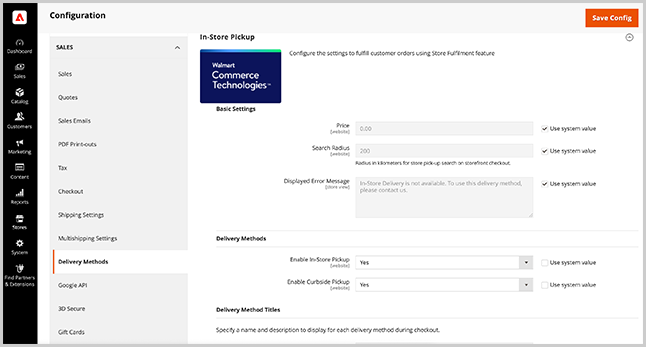

# Store service and sales configuration

Configure [!DNL Store Fulfillment] from the [!DNL Commerce] Admin to enable the extension, specify extension settings, configure the security settings for Store Assist app users, and set options for delivery methods.

>[!IMPORTANT]
>
>The Store Fulfillment service configuration applies only after you connect your Adobe Commerce instance and the [!DNL Store Fulfillment] app. See [Connect Store Fulfillment](connect-set-up-service.md).

## Manage Store Fulfillment services settings

Manage settings for Store Fulfillment services from the [!DNL Commerce Admin Store Configuration] menu.

- Enable the extension, configure global settings, and specify security options for Store Assist app user connections and accounts by selecting **[!UICONTROL Stores > Configuration > Services > Store Fulfillment by Walmart Commerce Technologies]**.

  

- Configure delivery methods by selecting **[!UICONTROL Store > Configuration > Sales > Delivery Methods > In-Store Pickup]**.

  

## Basic settings

<table>
<thead>
<tr>
<td><strong>Field</strong></td>
<td><strong>Description</strong></td>
<td><strong>Scope</strong></td>
<td><strong>Required</strong></td>
</tr>
</thead>
<tbody>
<tr>
<td><strong>[!UICONTROL Price]</strong></td>
<td>The price you charge the customer for in-store pickup. Defaults to zero.</td>
<td>Website</td>
<td>No</td>
</tr>
<tr>
<td><strong>[!UICONTROL Search Radius]</strong></td>
<td>The radius, in kilometers, to use when a shopper searches for a store pickup location in the storefront checkout. The search results return only stores located within the specified search radius.</td>
<td>Website</td>
<td>No</td>
</tr>
<tr>
<td><strong>[!UICONTROL Displayed error message]</strong></td>
<td>Message that displays when a customer selects in-store pickup for an item that is not available for in-store pickup. You can customize the default text if needed.
</td>
<td>Store View</td>
<td>No</td>
</tr>
</tbody>
</table>

>[!NOTE]
>
>The [!UICONTROL Search Radius] setting is used only if you have configured the [store location and mapping setup](store-location-map-provider-setup.md) for Adobe Commerce.

## Enable the Store Fulfillment solution

Enable the [!DNL Store Fulfillment] solution to add the in-store and curbside pickup capabilities to the shopping and checkout experiences in your Adobe Commerce storefront.

<table>
<thead>
<tr>
<td><strong>Field</strong></td>
<td><strong>Description</strong></td>
<td><strong>Scope</strong></td>
<td><strong>Required</strong></td>
</tr>
 </thead>
 <tbody>
<tr>
<td><strong>[!UICONTROL Enabled]</strong></td>
<td>Enable or disable the solution. When enabled, configure and use Store Fulfillment capabilities and establish the connection between your Adobe Commerce store and [!DNL Store Fulfillment] services. When disabled, all Store Fulfillment features are disabled, and there is no communication between Adobe Commerce and Store Fulfillment services. Order information cannot be processed or received.</td>
<td>Global</td>
<td>Yes</td>
</tr>
</tbody>
</table>

## Add Account Credentials

<table>
<tr>
<td><strong>Field</strong></td>
<td><strong>Description</strong></td>
<td><strong>Scope</strong></td>
<td><strong>Required</strong></td>
</tr>
<tr>
<td><strong>[!UICONTROL Environment]</strong></td>
<td>Select either <i>[!UICONTROL Sandbox]</i> or <i>[!UICONTROL Production]</i>  Selecting [!UICONTROL Sandbox] enables communication with fulfillment services in a test environment.  Selecting [!UICONTROL Production] enables communication with fulfillment services in a live environment.  You are given a set of credentials for each environment and can manage both sets in the same installation.   Save the credentials before validating the connection.</td>
<td>Global</td>
<td>Yes</td>
</tr>
<tr>
<td><strong>[!UICONTROL API Server URL]</strong></td>
<td>The URL to the Walmart Store Fulfillment API endpoint. This must be the fully qualified URL that is provided during the onboarding process. Store Fulfillment customers receive both a Sandbox and Production URL. When adding the values, ensure that you copy and paste the full URL, including trailing slash "/".</td>
<td>Global</td>
<td>Yes</td>
</tr>
<tr>
<td><strong>[!UICONTROL Token Auth Server URL]</strong></td>
<td>The URL to the Walmart Store Fulfillment Authentication endpoint. The value must be the fully qualified URL that is provided during the onboarding process. You receive both a Sandbox and Production URL. When adding the values, ensure that you copy and paste the full URL, including trailing slash "/".</td>
<td>Global</td>
<td>Yes</td>
</tr>
<tr>
<td><strong>[!UICONTROL Merchant Id]</strong></td>
<td>Your unique merchant (tenant) ID provided during the onboarding process. This ID is used to route orders to ensure that your merchant stores receive them.</td>
<td>Global</td>
<td>Yes</td>
</tr>
<tr>
<td><strong>[!UICONTROL Consumer Id]</strong></td>
<td>The unique integration ID provided during the onboarding process. This ID is used to authenticate all communication between Adobe Commerce and store fulfillment services</td>
<td>Global</td>
<td>Yes</td>
</tr>
<tr>
<td><strong>[!UICONTROL Consumer Secret]</strong></td>
<td>The unique integration key provided during the onboarding process. This key is used to authenticate all communication between Adobe Commerce and store fulfillment service.</td>
<td>Global</td>
<td>Yes</td>
</tr>
</table>

After you configure the [!UICONTROL Account Credentials], select <strong>[!UICONTROL Validate Credentials]</strong> to verify and establish a connection to the store fulfillment service for the first time.

## Configure Logging

Logs for store fulfillment services are available in the log file `var/log/walmart-bopis.log`.

Ask the system administrator to configure your environments to allow exception handling so that API-related exceptions can be captured through the firewall or cache.

Because the application log file can grow quickly, enable logging for the application only for a short time when needed–for example when troubleshooting store fulfillment issues for a [!DNL Commerce] order. This configuration prevents response time issues in production environments caused by large log files.

>[!TIP]
>
>For Adobe Commerce on-premises installations, ask your system administrator to set up log rotation for the `var/log/walmart-bopis.log` file to minimize the size. For Adobe Commerce on-premises installations, see [Log rotation](https://experienceleague.adobe.com/docs/commerce-operations/installation-guide/next-steps/configuration.html?lang=en#server-settings) in the _Adobe Commerce Installation Guide_. For Adobe Commerce on cloud infrastructure projects, see [View and manage logs](https://experienceleague.adobe.com/docs/commerce-cloud-service/user-guide/develop/test/log-locations.html).

<table>
<thead>
<tr>
<td><strong>Field</strong></td>
<td><strong>Description</strong></td>
<td><strong>Scope</strong></td>
<td><strong>Required</strong></td>
</tr>
</thead>
<tbody>
<tr>
<td><strong>[!UICONTROL Debug Mode]</strong></td>
<td>Debug Mode is used to increase the logged activity within the integration. When disabled, no debug information is logged. When enabled, all debug information is logged   All logged data can be found in the file: <pre>var/log/walmart-bopis.log</pre>
<td>Global</td>
<td>No</td>
</tr>
</tbody>
</table>

## Manage Order synchronization

Configure the settings to manage error handling for order synchronization, catalog attributes to use for barcode scanning during order picking, and configure order batch sizes for the store fulfillment queue.

You can view details about order synchronization operations from the Store Fulfillment Queue Management dashboard in the Admin (
<strong>[!UICONTROL System > Tools > Store Fulfillment Queue]</strong>).

### Synchronization Error Management

<table>
<tr>
<td><strong>Field</strong></td>
<td><strong>Description</strong></td>
<td><strong>Scope</strong></td>
<td><strong>Required</strong></td>
</tr>
<tr>
<td><strong>[!UICONTROL Retry Critical Error]</strong></td>
<td>Specifies the retry attempts for a record synchronization operation after a critical error occurs.  Critical errors occur anytime the integration fails to get a positive response from the fulfillment service. This can occur when the service is down or when there is an error in the order data being sent.  When the retry threshold is reached, the item remains in a queue but is not processed again. View all items with errors from <strong>[!UICONTROL System &gt; Tools &gt; Store Fulfillment Queue]</strong> Management in the Admin. To troubleshoot consistently failing items, contact your Account Manager.</td>
<td>Global</td>
<td>No</td>
</tr>
<tr>
<td><strong>[!UICONTROL Enable Error Notification Email]</strong></td>
<td>Enable error notifications to receive an email when the [!UICONTROL Retry Critical Error Threshold] is reached for an order. The notification includes any available details about the error.</td>
<td>Global</td>
<td>No</td>
</tr>
<tr>
<td><strong>[!UICONTROL Send Error Notification Email To]</strong></td>
<td>A comma-delimited list of recipient email addresses for error notifications.</td>
<td>Global</td>
<td>No</td>
</tr>
<tr>
<td><strong>[!UICONTROL Order Sync Exception Email Template]</strong></td>
<td>Specifies the email template used to notify recipients about order synchronization errors. A default template is provided. It does not support customization.</td>
<td>Store View</td>
<td>No</td>
</tr>
</table>

### Order Synchronization

<table>
<thead>
<tr>
<td><strong>Field</strong></td>
<td><strong>Description</strong></td>
<td><strong>Scope</strong></td>
<td><strong>Required</strong></td>
</tr>
</thead>
<tbody>
<tr>
<td><strong>[!UICONTROL Barcode Source]</strong></td>
<td>The catalog attribute that stores the scannable code for corresponding items in your merchant locations.  If you have only one existing merchant location, it is likely that you use UPC codes, while your e-commerce channel identifies products by SKU. If this is your scenario, select the catalog attribute that contains the UPC code.  This setting ensures that orders sent to your stores list items with the correct identifier so that store associates can accurately scan items during the picking process.  If you are unsure, check with your fulfillment associates in the Shipping and Picking department to determine which attribute should be sent. You might need to add the appropriate attribute to the Adobe Commerce product attribute set if the attribute is not currently included in the database.</td>
<td>Website</td>
<td>Yes</td>
</tr>
<tr>
<td><strong>[!UICONTROL Barcode Type]</strong></td>
<td>The catalog attribute that stores the barcode source for corresponding items in your merchant locations.  This setting ensures that orders sent to your stores list items with correct identifier so that store associates can accurately scan items during the picking process. The options include - SKU, UPC, GTIN, UPCA, EAN13, UPCE0, DISA, UAB, CODABAR, Price Embedded UPC.  If you are unsure, select the option that most closely resembles the values contained in your [!UICONTROL Barcode Source] attribute. Store associates can still match items manually from their pick list.</td>
<td>Website</td>
<td>Yes</td>
</tr>
<tr>
<td><strong>[!UICONTROL Max Number of Items]</strong></td>
<td>The maximum number of items to send from the store fulfillment queue at one time.  BOPIS orders are sent to the fulfillment service in batches, at regular intervals. This setting allows you to control the size of the batch.  The default value is 100 items. Depending on your order volume and capacity, you might need to adjust this value up or down.</td>
<td>Global</td>
<td>No</td>
</tr>
</tbody>
</table>

## Enable Store Fulfillment shipping options

Configure the Store Fulfillment shipping options that determine the availability of in-store pickup and home delivery options for your Adobe Commerce stores.

### Ship To Store

<table>
<thead>
<tr>
<td><strong>Field</strong></td>
<td><strong>Description</strong></td>
<td><strong>Scope</strong></td>
<td><strong>Required</strong></td>
</tr>
</thead>
<tbody>
<tr>
<td><strong>[!UICONTROL Enable Ship To Store]</strong></td>
<td>The ship-to-store setting is based on your existing ship-to-store capabilities. If you use Inventory Management, or if you can accept and fulfill orders at merchant locations with no inventory via store-to-store inventory transfers, set this option to `Yes`.  If you cannot support the ship-to-store option or do not wish to offer it, set to `No`. When disabled, items in your catalog with zero inventory for a merchant store, or items that are below that location's [!DNL Out of Stock Threshold], are not offered with in-store pickup options.  This is a global setting that can be adjusted per merchant location.</td>
<td>Global</td>
<td>No</td>
</tr>
</tbody>
</table>

### Ship From Store

<table>
<thead>
<tr>
<td><strong>Field</strong></td>
<td><strong>Description</strong></td>
<td><strong>Scope</strong></td>
<td><strong>Required</strong></td>
</tr>
</thead>
<tbody>
<tr>
<td><strong>[!UICONTROL Enable Ship From Store]</strong></td>
<td>Enables or disables the Home Delivery option in your merchant stores. When enabled, your merchant store locations are considered in aggregate with other assigned sources in the stock associated to your website.  In standard Inventory Management services, the [!DNL Ship from Store] is option is inherent and cannot be disabled. With the Store Fulfillment solution, you can turn it on or off.  This is a global setting. You can also adjust this setting per merchant location and product.</td>
<td>Global</td>
<td>No</td>
</tr>
</tbody>
</table>

## Manage Store Fulfillment App use accounts and permissions

Configure the settings for the Store Fulfillment App user account and password security and two-factor authentication.

### App Security

<table>
<thead>
<tr>
<td><strong>Field</strong></td>
<td><strong>Description</strong></td>
<td><strong>Scope</strong></td>
<td><strong>Required</strong></td>
</tr>
 </thead>
 <tbody>
<tr>
<td><strong>[!UICONTROL User Session Lifetime]</strong></td>
<td>The timeframe, in seconds, that a store associate user session remains active before automatic logout. Valid values range from 60 to 31536000.</td>
<td>Global</td>
<td>No</td>
</tr>
<tr>
<td><strong>[!UICONTROL Maximum Login Failures to Lockout Account]</strong></td>
<td>Specifies the number of failed login attempts allowed before a store associate is locked out of their account.  To disable account lockout, set the value to 0.</td>
<td>Global</td>
<td>No</td>
</tr>
<tr>
<td><strong>[!UICONTROL Lockout Time (minutes)]</strong></td>
<td>Number of minutes to lock an account after login failure.</td>
<td>Global</td>
<td>No</td>
</tr>
<tr>
<td><strong>[!UICONTROL Force Password Change]</strong></td>
<td><em>[!UICONTROL Yes]</em>: Require the user to change their password after account setup.  <em>[!UICONTROL No]</em>: Recommends that user change password after account setup.</td>
<td>Global</td>
<td>No</td>
</tr>
<tr>
<td><strong>[!UICONTROL Password Lifetime]</strong></td>
<td>The number of days that a password remains valid before a required password change. Leave empty to disable this option.</td>
<td>Global</td>
<td>No</td>
</tr>
</tbody>
</table>

### Two-factor authentication

<table>
<thead>
<tr>
<td><strong>Field</strong></td>
<td><strong>Description</strong></td>
<td><strong>Scope</strong></td>
<td><strong>Required</strong></td>
</tr>
 </thead>
 <tbody>
<tr>
<td><strong>[!UICONTROL APP User 2FA]</strong></td>
<td>Enable or disable two-factor authentication for store associates. When enabled, the store associate is prompted to provide a one-time password generated by an authentication provider.</td>
<td>Global</td>
<td>No</td>
</tr>
<tr>
<td><strong>[!UICONTROL APP 2FA Policy]</strong></td>
<td>Sets the enforcement policy for two-factor authentication.  <strong>[!UICONTROL Optional]</strong>: The store associate can bypass two-factor authentication if no provider is set.  <strong>[!UICONTROL Mandatory]</strong>: The store associate is required to complete two-factor authentication.</td>
<td>Global</td>
<td>No</td>
</tr>
<tr>
<td><strong>[!UICONTROL 2FA Providers]</strong></td>
<td>Select one or more authentication provider services to offer store associates. To set up two-factor authentication and authenticate, store associates must install the authentication app from one of the available providers installed on their mobile devices.</td>
<td>Global</td>
<td>No</td>
</tr>
</tbody>
</table>

## Delivery Methods 

Store Fulfillment works by extending the native Adobe Commerce [!DNL In-Store Delivery] capabilities. After you install the extension, you can configure in-store delivery methods using the following extended settings that are added to the Admin.

- **In-store pick up**—Offer options for in-store delivery during the checkout process
This is the most common delivery scenario for BOPIS orders.

- **[!UICONTROL Curbside pick up]**–Offer options for customers to park at a store location and have their order delivered to them by a store associate.

Configure these settings from the Admin by selecting <strong>[!UICONTROL Stores > Configuration > Sales > Delivery Methods > In-Store Pickup]</strong>.

>[!NOTE]
>
>For additional information about configuring in-store delivery options, see [In-Store Delivery](https://docs.magento.com/user-guide/shipping/shipping-in-store-delivery.html) in the _Adobe Commerce User Guide_.

### Delivery Methods Configuration

With the in-store delivery method, the customer can select a source to be used as a pickup location during the checkout.

<table>
<thead>
<tr>
<td><strong>Field</strong></td>
<td><strong>Description</strong></td>
<td><strong>Scope</strong></td>
<td><strong>Required</strong></td>
</tr>
 </thead>
 <tbody>
<tr>
<td><strong>[!UICONTROL Enable In-Store Pickup]</strong></td>
<td>Enable or disable the in-store pickup option available during checkout for customers that choose store pickup. When in-store pickup is disabled, the option is not displayed.  This global setting applies to all retail store locations. When enabled, you can selectively disable it at the retail store location.</td>
<td>Website</td>
<td>No</td>
</tr>
<tr>
<td><strong>[!UICONTROL Enable Curbside Pickup]</strong></td>
<td>Enable or disable the curbside pick up option during the checkout process for customers that choose store pickup.  This global setting applies to all retail store locations. When enabled, you can selectively disable it at the retail store location.</td>
<td>Website</td>
<td>No</td>
</tr>
</tbody>
</table>

### Delivery Method Title Configuration

<table>
<thead>
<tr>
<th><strong>Field</strong></th>
<th><strong>Description</strong></th>
<th><strong>Scope</strong></th>
<th><strong>Required</strong></th>
</tr>
</thead>
<tbody><tr>
<td><strong>Home Delivery Title</strong></td>
<td>Specifies the title to display for the Home Delivery option in the product, cart, and checkout areas. Home delivery refers to the standard shipping capabilities of Adobe Commerce—from a warehouse, by a carrier, or direct to the customer-provided shipping address.   This label does not affect the shipping method labels for the selected shipping carrier.</td>
<td>Store View</td>
<td>No</td>
</tr>
<tr>
<td><strong>Home Delivery Description</strong></td>
<td>An optional description that displays whenever the Home Delivery Title is shown to customers. Most often, the description is a static message to communicate your delivery promises. Some examples: <code>Same-day shipping on orders by 4</code>  <code>Ships within 2 business days</code></td>
<td>Store View</td>
<td>No</td>
</tr>
<tr>
<td><strong>Store Pickup Title</strong></td>
<td>When a customer is presented with delivery options and in-store pickup is available, this label is shown.   You can customize this label, which displays in the product, cart, and checkout areas.</td>
<td>Store View</td>
<td>No</td>
</tr>
<td><strong>Store Pickup Description</strong></td>
<td>Wherever the Store Pickup Title is shown, you can optionally include a description. This static message helps improve customer communications related to the store pickup experience. Some examples:  <code>Get it today for free!</code>  <code>Ready for pickup in an hour!</code></td>
<td>Store View</td>
<td>No</td>
</tr>
<tr>
<td><strong>In-Store Pickup Title</strong></td>
<td>When In-Store Pickup is enabled, this title is shown to customers as the Store Pickup delivery option. You can customize its label.</td>
<td>Store View</td>
<td>No</td>
</tr>
<tr>
<tr>
<td><strong>Curbside Pickup Title</strong></td>
<td>When Curbside Pickup is enabled, the option is shown to customers as a type of Store Pickup delivery option. You can customize its label here.</td>
<td>Store View</td>
<td>No</td>
</tr>
<tr>
<td><strong>In-Store Pickup Instructions</strong></td>
<td>When an order is ready for pickup at your retail stores, the customer is notified by e-mail. If the customer selected [!DNL In-Store Pickup] during checkout, you can customize the pickup instructions here.   This is a global setting that applies to all retail store locations. You can also customize the instructions at the retail store location level.</td>
<td>Store View</td>
<td>No</td>
</tr>
<tr>
<td><strong>Curbside Pickup Instructions</strong></td>
<td>Specifies customized order pickup instructions to include in customer email notifications for curbside pickup orders.   This is a global setting that applies to all retail store locations. You can also customize the instructions at the retail store location level.</td>
<td>Store View</td>
<td>No</td>
</tr>
<tr>
<td><strong>Estimated Pickup Lead Time</strong></td>
<td>The number of minutes required before an order is received, fulfilled, and ready to be picked up. This information is shown to the customer when selecting a retail store location for Store Pickup delivery option. This is a global setting and applies to all retail store locations. You can also customize the lead time at the retail store location level.</td>
<td>Store View</td>
<td>No</td>
</tr>
<tr>
<td><strong>Estimated Pickup Time Label</strong></td>
<td>Displays the estimated time until an order is available for customer pickup. This information is shown to customers when they select a retail store location for the [!DNL In-Store Pickup] delivery option.   When customizing this label, you can use the code <code>%1</code> to insert your <strong>Estimated Pickup Lead Time</strong>. For example:  <code>Ready for Pickup in %1 minutes.</code>  This is a global setting that applies to all retail store locations. You can also customize the lead time at the retail store location level.</td>
<td>Store View</td>
<td>No</td>
<tr>
<td><strong>Pickup Time Disclaimer</strong></td>
<td>The content displayed on the product page in the tooltip that lists store hours, holidays, unexpected closures, and so on</td>
<td>Store View
</td>
<td>No
</td>
</tr>
</tbody></table>

### Stock Availability Titles Configuration

<table>
<thead>
<tr>
<th><strong>Field</strong></th>
<th><strong>Description</strong></th>
<th><strong>Scope</strong></th>
<th><strong>Required</strong></th>
</tr>
</thead>
<tbody><tr>
<td><strong>In-Stock</strong></td>
<td>When a customer is using the retail store locator, inventory availability for the current items is shown for each location.   You can customize the <em>[!UICONTROL in-stock]</em> status label here.</td>
<td>Store View</td>
<td>No</td>
</tr>
<tr>
<td><strong>Out-of-Stock</strong></td>
<td>When a customer is using the retail store locator, inventory availability for any current items is shown for each location.</td>
<td>Store View</td>
<td>No</td>
</tr>
<tr>
<td><strong>Partially In-Stock</strong></td>
<td>When a customer is using the retail store locator, inventory availability for any current items ia shown for each location.   You can customize the <em>[!UICONTROL partially in-stock]</em> status label here.</td>
<td>Store View</td>
<td>No</td>
</tr>
</tbody></table>
